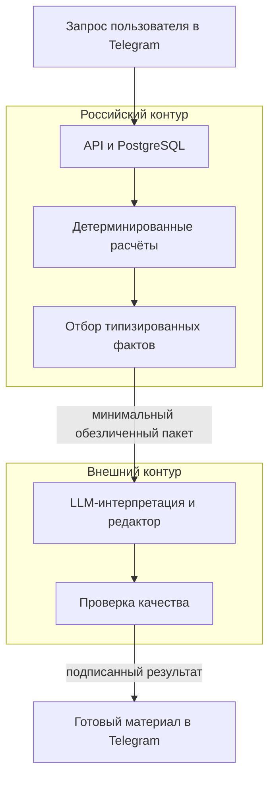

# Chronica — персональная ИИ- и медиаплатформа

Chronica — персональная ИИ-платформа в Telegram и система автоматизированного медиапроизводства. В этом репозитории представлено воспроизводимое ядро видеоконвейера: оно превращает типизированный сценарий в MP4 с озвучкой и субтитрами, а `artifact manifest` фиксирует состояние этапов и целостность каждого результата.

**Продукт:** [Telegram-бот Chronica](https://t.me/MyChronicaBot) · [YouTube-канал Chronica](https://youtube.com/@chronicaverse)

<p align="center">
  <a href="docs/assets/telegram-product.png">
    
  </a>
</p>
<p align="center"><sub>Публичная карточка продукта и реальный диалог в Telegram. Нажмите на изображение, чтобы увеличить.</sub></p>

## Продукт

Chronica объединяет два самостоятельных, но связанных контура:

- **персональный сервис в Telegram** с вводным сценарием, явным согласием на обработку данных, профилем, Хрониками дня, недели и месяца, системными разборами, личными вопросами, подпиской и платежами;
- **публичный медиаконвейер** для регулярного выпуска длинных видео и Shorts: сценарии, TTS, расшифровка, субтитры, музыка, программная сборка в Remotion, обложки, метаданные и публикация на видеоплатформах.

Видео опираются на общий контекст периода и не используют профили или персональные результаты пользователей. Медиаконвейер работает независимо от личного сервиса и одновременно помогает новой аудитории познакомиться с Chronica.

Производственный цикл рассчитан на еженедельный выпуск 12 длинных роликов и 14 Shorts. Отдельный модуль Chronica Public Publisher публикует готовые материалы на Rutube, VK Видео, OK Видео и Дзен. На момент внутренней проверки в нём было зафиксировано 40 уникальных видео и 93 публикации на этих четырёх платформах.

<p align="center">
  <a href="docs/assets/publisher-dashboard.png">
    
  </a>
</p>
<p align="center"><sub>Панель оператора: состояние входа, очередь и результаты публикации на четырёх российских платформах.</sub></p>

## Роль и объём работы

Работа над Chronica охватывала весь продукт: от пользовательских сценариев и архитектуры данных до генерации материалов, медиапроизводства, проверки качества и эксплуатации системы.

Ключевые решения:

- разделение персонального продукта и публичного медиапроизводства;
- российский контур постоянного хранения персональных данных и детерминированных расчётов;
- минимальный обезличенный набор данных для LLM — без прямых идентификаторов Telegram, данных профиля и необработанных результатов расчётов;
- генерация с опорой на типизированные факты, смысловой черновик, редактор, исправление и проверки качества;
- многоступенчатый `resumable workflow` с контрольными точками в манифесте артефактов;
- независимый модуль публикации с очередью, понятными состояниями и передачей задачи оператору, если требуется вход, капча или ручная проверка;
- единая продуктовая система, связывающая контент, его распространение и монетизацию сервиса в Telegram.

## Два контура данных и генерации

Персональные данные и генеративная интерпретация обрабатываются в разных контурах.



В российском контуре выполняются расчёты по нескольким системам, нормализация и отбор фактов по правилам. Внешняя модель получает только тот набор фактов, который нужен для конкретного запроса, и одноразовый `generationId`. LLM интерпретирует уже рассчитанные данные, но не выполняет сами расчёты.

Такой подход превращает вызов ИИ из непрозрачного запроса к модели в управляемую цепочку: **расчёт → проверенные факты → смысловой черновик → редактор → проверки → готовый материал**.

## Медиапроизводство

<p align="center">
  <a href="docs/assets/generated-video.gif">
    
  </a>
</p>
<p align="center"><sub>Фрагмент реального выпуска на YouTube: программная композиция, синхронизированная графика и субтитры. Нажмите, чтобы открыть GIF в полном размере.</sub></p>

Так устроен медиаконвейер:


Полный производственный процесс:

```text
контекст периода
    → генерация сценария
    → проверка структуры и исправление
    → блоки озвучки
    → разбиение текста для TTS и сборка аудио
    → распознавание речи и временная разметка субтитров
    → музыка и композиция
    → программная сборка в Remotion
    → обложка и метаданные
    → манифест артефактов
    → публикация на видеоплатформах
```

Главная инженерная сложность ИИ-видео — согласованность зависимых преобразований. Неверная структура сценария влияет на композицию, ограничения TTS требуют безопасного разбиения текста, а временная разметка должна строиться по фактической длительности готового аудио.

## Что показывает этот репозиторий

В репозитории можно запустить весь медиаконвейер:

- строгая схема данных, возвращаемых LLM;
- отдельный этап исправления после неуспешной проверки структуры;
- разбиение текста озвучки по ограничениям внешнего сервиса без потери порядка;
- сборка WAV и временная разметка по фактической длительности аудио;
- резервный эвристический способ создания субтитров;
- программная сборка видео в Remotion;
- `stage journal` со статусами этапов и атомарным обновлением манифеста;
- счётчик попыток каждого этапа, позволяющий отличить переиспользование результата от фактического повторного выполнения;
- явный граф зависимостей этапов и причина решения `reused` или `executed` в манифесте;
- SHA-256 и размер каждого артефакта: готовый результат переиспользуется только после проверки целостности;
- повторный запуск с того этапа, на котором остановился предыдущий процесс, без повторных вызовов LLM и TTS для проверенных результатов;
- `provider boundary` для внешних сервисов и локальные воспроизводимые реализации;
- тесты доверительной границы LLM, восстановления после сбоя, разбиения текста и временной разметки.

## Почему выбраны такие решения

### Результат LLM проверяется до попадания в систему

Ответ LLM пересекает явную доверительную границу: сначала проходит проверку по структурному контракту и только затем становится частью предметной модели. Исправление вынесено в отдельный этап, поэтому его можно отслеживать, ограничивать и изменять независимо от основного провайдера генерации.

### Текст для TTS разбивается заранее

Текст озвучки разбивается с учётом границ предложений и ограничений сервиса. Повторная генерация затрагивает небольшой аудиоблок, а не весь выпуск.

### Временная разметка строится по готовому аудио

Композиция и субтитры получают фактические длительности после синтеза речи. Remotion детерминированно собирает кадры, не пытаясь заранее предсказать скорость произношения.

### Манифест обеспечивает восстановление

После каждого этапа манифест атомарно сохраняет статус, число попыток и метаданные артефакта. При повторном запуске `runPipeline` сверяет путь, размер и SHA-256; повреждённый файл пересоздаётся вместе с зависимыми результатами, а проверенные этапы не выполняются повторно. Счётчик попыток делает это поведение наблюдаемым и проверяемым в тестах.

Зависимости заданы явно: изменение сценария инвалидирует озвучку, субтитры и видео, тогда как повреждение аудио не вызывает новый запрос к LLM. Для каждого этапа манифест сохраняет причину выполнения или переиспользования, поэтому решение о восстановлении можно проверить после завершения процесса.

### Внешние сервисы отделены от управления процессом

LLM и TTS подключаются через интерфейсы провайдеров. Оркестрацию, проверки, восстановление и сборку видео можно воспроизвести локально без рабочих учётных данных.

## С чего начать обзор кода

1. [runPipeline.ts](src/pipeline/runPipeline.ts) — оркестрация этапов, checkpoint и восстановление.
2. [validation.ts](src/domain/validation.ts) — доверительная граница результата LLM.
3. [scenario.ts](src/services/scenario.ts) — генерация, повтор и исправление.
4. [speech.ts](src/services/speech.ts) — разбиение текста для TTS и сборка аудио.
5. [narration.ts](src/services/narration.ts) — речевые блоки и временная разметка.
6. [render.ts](src/services/render.ts) — программная сборка видео в Remotion.
7. [manifest.ts](src/services/manifest.ts) — атомарная запись и проверка артефактов.
8. [pipeline.test.ts](tests/pipeline.test.ts) — сценарии восстановления и медиапроизводства.

## Минимальный исполняемый сценарий

Для быстрой проверки нужны Node.js 22+ и зависимости проекта:

```bash
npm ci
npm run pipeline:no-render
```

Команда создаёт сценарий, WAV, субтитры и манифест, проверяя все границы до видеорендера. Полная сборка MP4 остаётся отдельной проверкой и требует Chromium или Chrome:

```bash
npm run pipeline
```

Локальные провайдеры нужны только для воспроизводимости. Основной предмет обзора — структурная проверка данных, граф зависимостей, целостность артефактов и восстановление после частичного сбоя.

## Тесты и проверки

```bash
npm run format:check
npm run lint
npm run typecheck
npm run test:coverage
npm audit --omit=dev --audit-level=high
```

Порог покрытия составляет 90% строк, 90% функций и 80% ветвей. GitHub Actions дополнительно проверяет production-зависимости и выполняет короткую пробную сборку видео.

## Границы публичного репозитория

Репозиторий показывает ту часть системы, где результат ИИ превращается в воспроизводимое видео. Персональная методика, пользовательские данные, рабочие запросы к модели, платежи и инфраструктура остаются в закрытом контуре. Представленный медиаконвейер можно запускать и проверять независимо от него.

## Автор

**Натали Антро — AI Product Engineer.**

Система Chronica создана и запущена полностью самостоятельно — от продуктовой концепции и архитектуры с учётом требований к персональным данным до ИИ- и медиаконвейеров, тестирования, развёртывания и эксплуатации.
