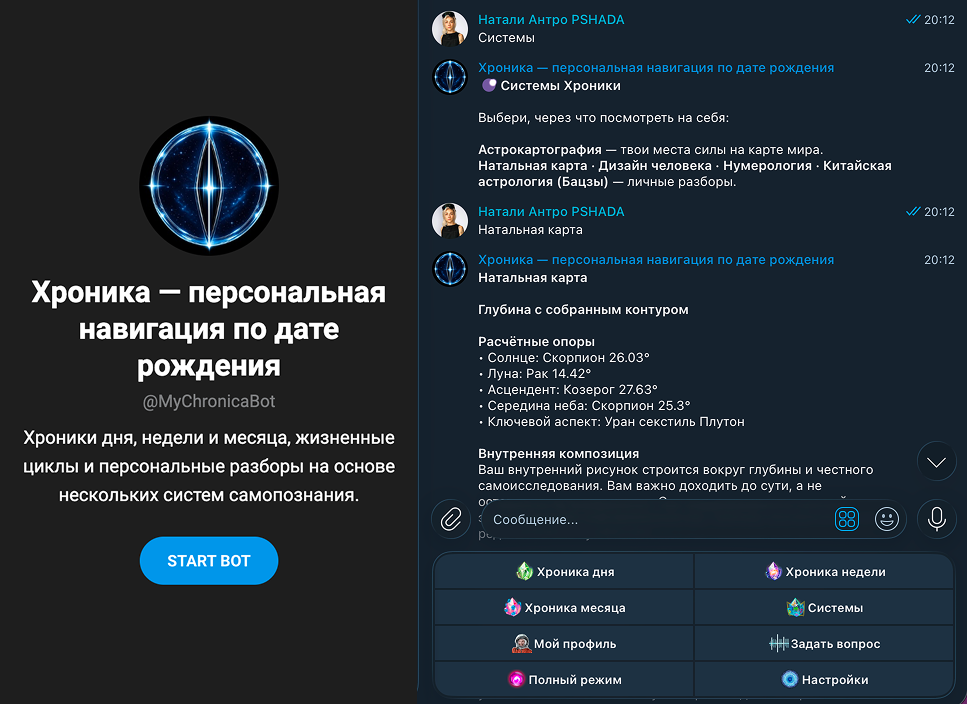
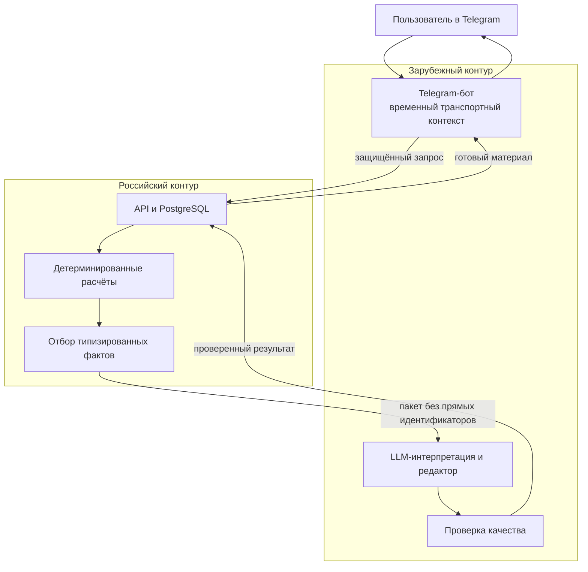
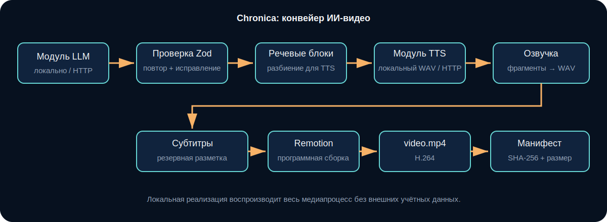
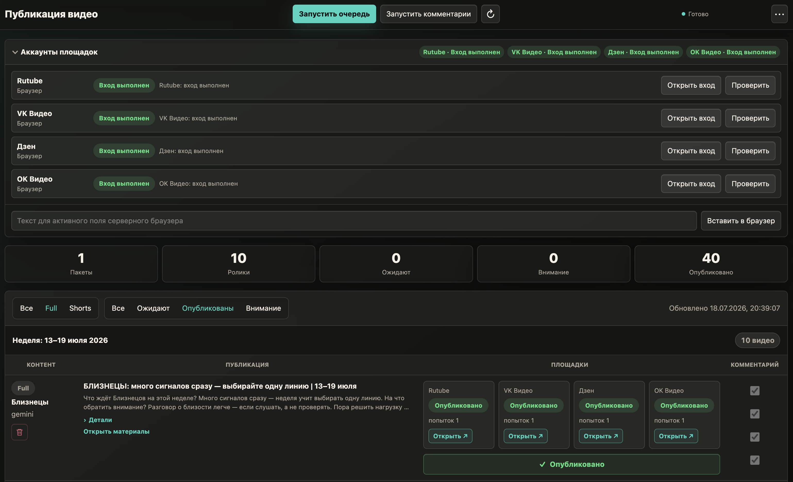

# Chronica — персональная ИИ- и медиаплатформа

Chronica — персональная ИИ-платформа в Telegram и система автоматизированного медиапроизводства. В этом репозитории представлено воспроизводимое ядро видеоконвейера: оно превращает типизированный сценарий в MP4 с озвучкой и субтитрами, а манифест артефактов фиксирует состояние этапов и целостность каждого результата.

**Продукт:** [Telegram-бот Chronica](https://t.me/MyChronicaBot) · [YouTube-канал Chronica](https://youtube.com/@chronicaverse)

> **Публичный engineering showcase.** Репозиторий содержит независимо запускаемый контур медиопроизводства и доверительную границу LLM реальной коммерческой платформы Chronica. Полная production-система также включает персональный Telegram-сервис, расчётные движки, подписки и платежи, защищённое хранение данных, расписания и рабочие интеграции публикации и эксплуатации, которые остаются в закрытом продукте.

<p align="center">
  <a href="docs/assets/telegram-product.png">
    
  </a>
</p>
<p align="center"><sub>Публичная карточка продукта и реальный диалог в Telegram. Нажмите на изображение, чтобы увеличить.</sub></p>

## Продукт

Chronica объединяет два самостоятельных, но связанных продуктовых направления:

- **персональный сервис в Telegram** с вводным сценарием, явным согласием на обработку данных, профилем, Хрониками дня, недели и месяца, системными разборами, личными вопросами, подпиской и платежами;
- **публичный медиаконвейер** для регулярного выпуска длинных видео и Shorts: сценарии, TTS, расшифровка, субтитры, музыка, программная сборка в Remotion, обложки, метаданные и публикация на YouTube.

Видео опираются на общий контекст периода и не используют профили или персональные результаты пользователей. Медиаконвейер работает независимо от личного сервиса и одновременно помогает новой аудитории познакомиться с Chronica.

В рабочей эксплуатации медиаконвейер обеспечивает выбранный ритм основного YouTube-канала — 12 длинных роликов и 14 Shorts в неделю. Готовые видео публикуются через официальный YouTube API.

## Роль и объём работы

Работа над Chronica охватывала весь продукт: от пользовательских сценариев и архитектуры данных до генерации материалов, медиапроизводства, проверки качества и эксплуатации системы.

Ключевые решения:

- разделение персонального продукта и публичного медиапроизводства;
- два контура обработки: российская система постоянного хранения персональных данных и детерминированных расчётов, внешний слой Telegram- и ИИ-интеграций;
- минимально необходимый пакет данных для LLM — без прямых идентификаторов Telegram, полей анкеты и необработанных результатов расчётов;
- генерация с опорой на типизированные факты, смысловой черновик, редактор, исправление и проверки качества;
- многоступенчатый возобновляемый процесс с контрольными точками в манифесте артефактов;
- дополнительный модуль дистрибуции Chronica Public Publisher на Playwright: импорт медиапакета из S3, очередь, явные состояния и передача задачи оператору, если требуется вход, капча или ручная проверка;
- единая продуктовая система, связывающая контент, его распространение и монетизацию сервиса в Telegram.

## Два контура данных и генерации

Архитектура Chronica разделена на российский и зарубежный контуры прежде всего с учётом требований [Федерального закона № 152-ФЗ «О персональных данных»](https://www.consultant.ru/document/cons_doc_LAW_61801/). Основная база персональных данных граждан России размещена в российском контуре в соответствии с требованиями части 5 статьи 18.

В российском контуре обрабатываются и хранятся анкеты пользователей, даты и места рождения, контактные данные, согласия, история расчётов, состояния подписки и сведения, связанные с оплатой. Там же выполняются детерминированные расчёты, нормализация и отбор фактов по правилам.



Зарубежный контур обслуживает Telegram-бота и внешние сервисы, но не является основной базой персональных данных. Временный транспортный контекст ограничен сроком выполнения запроса. Каждая интеграция получает только необходимый ей объём информации: внешней модели передаются отобранные для конкретного запроса типизированные факты и одноразовый `generationId`, но не прямые идентификаторы Telegram, поля анкеты или необработанные результаты расчётов. LLM интерпретирует уже рассчитанные данные, но не выполняет сами расчёты.

Граница между контурами задаёт точки контроля для разграничения доступа, защищённого обмена и проверки состава передаваемого пакета. Ограниченные сроки хранения временных данных и минимизация внешнего контекста уменьшают поверхность доступа и объём технически необходимой трансграничной передачи. Такое устройство создаёт техническую основу для организационных и защитных мер, предусмотренных статьями 18.1 и 19 закона, включая защиту от неправомерного доступа, изменения, копирования и распространения данных, и не смешивает основное хранилище персональных данных с Telegram- и LLM-интеграциями.

Такой подход превращает вызов ИИ из непрозрачного запроса к модели в управляемую цепочку: **расчёт → проверенные факты → смысловой черновик → редактор → проверки → готовый материал**.

## Медиапроизводство

<p align="center">
  <a href="docs/assets/generated-video.gif">
    
  </a>
</p>
<p align="center"><sub>Фрагмент реального выпуска на YouTube: программная композиция, синхронизированная графика и субтитры. Нажмите, чтобы открыть GIF в полном размере.</sub></p>

Так устроен медиаконвейер:



Полный производственный процесс:

```text
контекст периода
    → генерация сценария
    → проверка структуры и исправление
    → блоки озвучки
    → разбиение текста для TTS и сборка аудио
    → распознавание речи и временная разметка субтитров
    → музыка и композиция
    → программная сборка в Remotion
    → обложка и метаданные
    → манифест артефактов
    → публикация на YouTube через официальный API
    → передача готового медиапакета в S3
    → импорт в Chronica Public Publisher
    → автоматизированная публикация на Rutube, VK Видео, OK Видео и Дзен
```

Главная инженерная сложность ИИ-видео — согласованность зависимых преобразований. Неверная структура сценария влияет на композицию, ограничения TTS требуют безопасного разбиения текста, а временная разметка должна строиться по фактической длительности готового аудио.

### Дополнительная дистрибуция

YouTube остаётся основным каналом публикации и подключён через официальный API. После публикации готовый медиапакет — видео, обложка и метаданные — передаётся в S3.

Chronica Public Publisher реализован на Playwright. Он импортирует медиапакет из объектного хранилища, независимо выполняет дополнительную дистрибуцию на российские видеоплатформы, управляет очередью и состояниями авторизации и передаёт задачу оператору, если требуется вход, капча или ручная проверка.

<p align="center">
  <a href="docs/assets/publisher-dashboard.png">
    
  </a>
</p>
<p align="center"><sub>Дополнительный контур распространения: состояние входа, очередь и результаты публикации на четырёх российских платформах.</sub></p>

## Что показывает этот репозиторий

В репозитории можно запустить сквозной контур видеопроизводства — от типизированного сценария до MP4:

- строгая схема данных, возвращаемых LLM;
- отдельный этап исправления после неуспешной проверки структуры;
- разбиение текста озвучки по ограничениям внешнего сервиса без потери порядка;
- сборка WAV и временная разметка по фактической длительности аудио;
- резервный эвристический способ создания субтитров;
- программная сборка видео в Remotion;
- журнал этапов со статусами и атомарным обновлением манифеста;
- счётчик попыток каждого этапа, позволяющий отличить переиспользование результата от фактического повторного выполнения;
- явный граф зависимостей этапов и причина решения `reused` или `executed` в манифесте;
- SHA-256 и размер каждого артефакта: готовый результат переиспользуется только после проверки целостности;
- повторный запуск с того этапа, на котором остановился предыдущий процесс, без повторных вызовов LLM и TTS для проверенных результатов;
- интерфейсные границы внешних сервисов и локальные воспроизводимые реализации;
- тесты доверительной границы LLM, восстановления после сбоя, разбиения текста и временной разметки.

## Почему выбраны такие решения

### Результат LLM проверяется до попадания в систему

Ответ LLM пересекает явную доверительную границу: адаптер Responses API запрашивает Structured Outputs со строгой JSON Schema, затем результат повторно проверяется Zod внутри системы. Только после этого он становится частью предметной модели. Промпты `generate` и `repair` версионируются в коде; версия передаётся провайдеру и доступна для диагностики.

`generateScenarioWithTrace` выполняет ограниченный цикл `generate → validate/evaluate → repair`. Каждая попытка сохраняет действие, решение и ошибки. Трасса рабочего запуска записывается в `scenario-trace.json`, входит в манифест и проверяется по SHA-256 вместе со сценарием. После исчерпания бюджета конвейер завершается явной ошибкой, а не продолжает работу с сомнительным сценарием.

### Качество модели проверяется отдельно от схемы

`evaluateScript` отделяет валидность схемы от качества результата. Детерминированный gate измеряет уникальность заголовков и section IDs, лексическое разнообразие, покрытие темы и обязательных понятий, повторы предложений, запрещённые паттерны и неподтверждённые числовые утверждения.

Evaluation-набор содержит семь тематических случаев, включая privacy, RAG, model drift и prompt injection. Каждый case по умолчанию выполняется три раза: отчёт сохраняет распределение результатов, `stabilityRate`, `firstPassRate`, p95 latency и историю исправлений. Порог case задаётся по доле успешных повторов, поэтому случайный единичный ответ не выдаётся за устойчивое качество. Локальный deterministic baseline воспроизводим без сети; тот же контракт запускается через реальную модель, а число повторов управляется `EVAL_RUNS`:

```bash
EVAL_PROVIDER=external EVAL_RUNS=3 npm run eval
```

### Текст для TTS разбивается заранее

Текст озвучки разбивается с учётом границ предложений и ограничений сервиса. Даже одиночный URL или token длиннее лимита делится на допустимые chunks, поэтому provider не получает скрытое превышение размера запроса. Worker pool ограничивает число одновременных TTS-вызовов и сохраняет исходный порядок аудиоблоков независимо от порядка ответов.

### Временная разметка строится по готовому аудио

Каждый ответ TTS разбирается как RIFF/WAVE: проверяются `fmt` и `data` chunks, PCM format, mono, 16 kHz, 16 bit, byte rate и границы данных. Длительность вычисляется из готового PCM payload, а не из текста или HTTP-заголовка. Композиция и субтитры получают измеренные длительности, после чего Remotion детерминированно собирает кадры.

### Манифест обеспечивает восстановление

После каждого этапа манифест атомарно сохраняет статус, число попыток и метаданные артефакта. При повторном запуске `runPipeline` сверяет путь, размер и SHA-256; повреждённый файл пересоздаётся вместе с зависимыми результатами, а проверенные этапы не выполняются повторно. Счётчик попыток делает это поведение наблюдаемым и проверяемым в тестах.

Зависимости заданы явно. Каждый этап хранит SHA-256 fingerprint семантических входов: темы, версии prompt/evaluation contract, профиля LLM/TTS, лимита chunking и версии композиции. Смена темы, модели или промпта инвалидирует сценарий и его потомков даже при неизменном `RUN_ID`; смена TTS-профиля сохраняет сценарий, но пересобирает звук, субтитры и видео. Повреждение аудио, наоборот, не вызывает новый запрос к LLM. Для каждого этапа манифест сохраняет fingerprint и причину выполнения или переиспользования. Пользовательский `RUN_ID` проверяется до создания каталога: разрешённый формат исключает абсолютные пути и выход за пределы `artifacts/`.

### Внешние сервисы отделены от управления процессом

LLM и TTS подключаются через интерфейсы провайдеров. HTTP-запросы имеют явные тайм-ауты, а метаданные TTS проверяются до попадания в медиаконвейер. Оркестрацию, проверки, восстановление и сборку видео можно воспроизвести локально без рабочих учётных данных.

## С чего начать обзор кода

1. [runPipeline.ts](src/pipeline/runPipeline.ts) — оркестрация этапов, контрольные точки и восстановление.
2. [validation.ts](src/domain/validation.ts) — доверительная граница результата LLM.
3. [llm.ts](src/providers/llm.ts) и [prompts/scenario.ts](src/prompts/scenario.ts) — Responses API, строгая схема и версионируемые промпты.
4. [services/scenario.ts](src/services/scenario.ts) и [scriptEvaluation.ts](src/evaluation/scriptEvaluation.ts) — ограниченный цикл исправления, трасса выполнения и контроль качества.
5. [speech.ts](src/services/speech.ts) — разбиение текста для TTS и сборка аудио.
6. [narration.ts](src/services/narration.ts) — речевые блоки и временная разметка.
7. [render.ts](src/services/render.ts) — программная сборка видео в Remotion.
8. [manifest.ts](src/services/manifest.ts) — атомарная запись и проверка артефактов.
9. [pipeline.test.ts](tests/pipeline.test.ts) — сценарии восстановления и медиапроизводства.

## Минимальный исполняемый сценарий

Для быстрой проверки нужны Node.js 22+ и зависимости проекта:

```bash
npm ci
npm run pipeline:no-render
```

Команда создаёт сценарий, WAV, субтитры и манифест, проверяя все границы до видеорендера. Полная сборка MP4 остаётся отдельной проверкой и требует Chromium или Chrome:

```bash
npm run pipeline
```

Локальные провайдеры обеспечивают воспроизводимый запуск без внешних учётных данных; структурная проверка, граф зависимостей, целостность артефактов и восстановление выполняются тем же прикладным контуром.

## Тесты и проверки

```bash
npm run format:check
npm run lint
npm run typecheck
npm run test:coverage
npm run eval
npm audit --omit=dev --audit-level=high
```

Порог покрытия составляет 90% строк, 90% функций и 80% ветвей. GitHub Actions дополнительно проверяет зависимости рабочей сборки, выполняет evaluation-набор и создаёт настоящий H.264 MP4 через Remotion в отдельном CI smoke run.

## Публичный инженерный контур

Публичный контур охватывает доверительную границу LLM, оценку сценария, медиапроизводство и восстановление артефактов. Он запускается независимо и сохраняет архитектурные инварианты рабочей системы; персональные данные и коммерческие интеграции остаются изолированы.

## Автор

**Натали Антро — AI Product Engineer, создатель и единственный разработчик продукта.**
